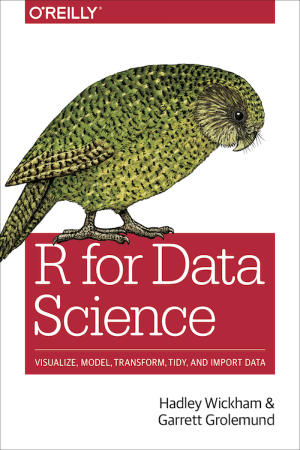

## Textbook

The textbook is Garrett Grolemund and Hadley Wickham, _R for Data Science_. 

* the book, in its most up-to-date form, is freely available online at [r4ds.had.co.nz](https://r4ds.had.co.nz/)

* paperback and ebook version are available at the UVic Bookstore or other retailers

## Additional Reading

Other resources&#8212;some required, some vital reference resources, and some optional "food for thought"&#8212;will be included in the  materials for each week's class. This is a cumulative resource list.

### Other text books

Garrett Grolemund, 2014, [_Hands-On Programming with R_](https://rstudio-education.github.io/hopr/)

Kieran Healy, 2019, [_Data Visualization: A Practical Introduction_](http://socviz.co/) (draft version of the manuscript)

Chester Ismay and Albert Y. Kim, 2019, [An Introduction to Statistical and Data Sciences via R](http://moderndive.com/) _a.k.a._ "Modern Dive"

Roger Peng, 2019-12-22, [_R Programming for Data Science_](https://bookdown.org/rdpeng/rprogdatascience/)

### Articles

#### Week 1 - Data organization and practice

Karl Broman and Kara Woo, 2017, ["Data organization in spreadsheets"](https://doi.org/10.1080/00031305.2017.1375989), _The American Statistician_ 72 (1): 2–10.

Hilary Parker, 2017-08-31, [Opinionated Analysis Development](https://peerj.com/preprints/3210/)

Hadley Wickham. ["Tidy data"](https://vita.had.co.nz/papers/tidy-data.html), _The Journal of Statistical Software_, vol. 59, 2014.

Wilson G, Bryan J, Cranston K, Kitzes J, Nederbragt L, Teal TK (2017) "Good enough practices in scientific computing", PLoS Comput Biol 13(6): e1005510. [https://doi.org/10.1371/journal.pcbi.1005510](https://doi.org/10.1371/journal.pcbi.1005510)

#### Week 4 - VBA for Microsoft Office

["Getting started with VBA in Office"](https://docs.microsoft.com/en-us/office/vba/library-reference/concepts/getting-started-with-vba-in-office), Microsoft

#### Week 5 - Dates and times

[Working with dates and time in R using the lubridate package](https://data.library.virginia.edu/working-with-dates-and-time-in-r-using-the-lubridate-package/), University of Virginia Library Research Data Services + Sciences

#### Week 6 - What-if analysis

Stefano Rizzi, ["What-If Analysis"](http://www-db.deis.unibo.it/~srizzi/PDF/eds-WIA.pdf), 

[Introduction to What-If Analysis](https://support.office.com/en-us/article/introduction-to-what-if-analysis-22bffa5f-e891-4acc-bf7a-e4645c446fb4) -- for Microsoft Excel

### Other web resources

[R for Social Scientists](https://datacarpentry.org/r-socialsci/) -- DataCarpentry lesson

***

## Data Sources

[FiveThirtyEight](https://fivethirtyeight-r.netlify.com/articles/fivethirtyeight.html)

[Gapminder](https://www.gapminder.org/data/)

[Tidy Tuesday](https://github.com/rfordatascience/tidytuesday)

***

## R resources

[RStudio projects](https://support.rstudio.com/hc/en-us/articles/200526207-Using-Projects)

***

## GitHub repository

The course lessons and lesson plans can be found at the GitHub respository [UVic_BIDA302_2019](https://github.com/MonkmanMH/UVic_BIDA302_2019)

-30-

