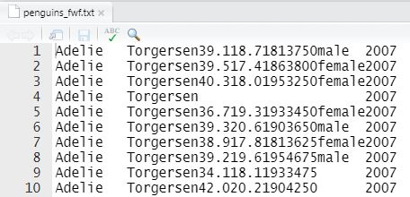

<small><i>Gentoo penguins in Antarctica, walking along a "penguin highway", a path that joins the sea and their nesting area on a rocky outcrop.</i></small>


Who doesn't like penguins? They have a quirky charm, and are an amazing demonstration of the power of evolution: they fly but only underwater, and are adapted to thrive in some of the harshest climates on Earth.

The {palmerpenguins} R package contains data collected at the [Palmer Station](https://www.usap.gov/videoclipsandmaps/palwebcam.cfm) on [Anvers Island in the Antarctic](https://www.openstreetmap.org/search?query=palmer%20road#map=16/-64.7741/-64.0503){target="blank"}. The data is measurement information about three different species of penguins, from three smaller islands in the area. You can find out more about the data in the package, as well as some examples of exploring and analyzing the data using R, here: https://allisonhorst.github.io/palmerpenguins/ 


## fixed-width files

This exercise in data import uses a modification of the data found in the {palmerpenguin} package—I have converted the data file to a fixed-width format. This type of plain text file isn't used as much as other types, but you may come across them in your data science journey. 

One of the attributes of fixed-width files is that there are no delimiters as there are in CSV (Comma-Separated Value) files. Instead, specific columns in the table are assigned to a particular variable. This means that for very large files, reading in the data can be accomplished more efficiently because the need to search for commas in every row has been removed. 

There is also a reason, less important now that memory is far less expensive than it was, to create files that minimize the number of characters, including white space. (When data was stored on punch cards, which had a physical constraint of an 80 character width, methods to eliminate _any_ superfluous characters were sought. ^[Randall Munroe, [Google's Datacentres on Punch Cards](https://what-if.xkcd.com/63/){target="blank"}])

Here in 2020, cheaper storage and efficient compression methods have meant that CSV files with unfixed variable lengths are more common, but in some big data applications, fixed-width files are still used.


## fixed-width penguins

The first 10 rows of the `penguins_fwf.txt` file look like this:



Note that the first row does _not_ contain the variable names, but the first record—the observed characteristics of the first penguin in our dataset. This type of structure, with the variable names stored separately, is common in fixed-width files.

Also note that white space is at a minimum. For example, in the first records there are two spaces after the word "male" because "female" has two more letters (as is shown in the second record); the variable has to be long enough to accommodate the longest value. In data files where the creators are _really_ serious about saving space, a variable like `sex` would be coded using a single digit (perhaps 1 = "female" and 2 = "male", but be careful! ^[[Boys will be boys: Data error prompts U-turn on study of sex differences in school](https://retractionwatch.com/2017/10/17/boys-will-boys-data-error-prompts-u-turn-study-sex-differences-school/)—RetractionWatch.com]), rather than the six characters required to spell out the words.


In the `palmerpenguins_fwf.txt` file there are 8 different variables, described in the table below:

Variable           Width   Start position   End position
--------           -----   --------------   ------------
species            9       1                9
island             9       10               18
bill_length_mm     4       19               22
bill_depth_mm      4       23               26
flipper_length_mm  3       27               29
body_mass_g        4       30               33
sex                6       34               39
year               4       40               43

This sort of detailed table is common in a data dictionary, and is an important element in parsing a fixed-width file. By providing both the width and the start and end positions, the creator of the data dictionary saves the person reading the data some effort. And providing both width and position also provides a double-check on the accuracy of the location specifications.


## importing fixed-width files with {readr} 

The tidyverse package {readr}, part of the tidyverse family of R packages, provides some functions that make reading these files efficient.

```{r}
# load the {readr} package
library(readr)
```


The widths and variable names can be added as lists to the `fwf_widths` argument:

```{r message=FALSE, error=FALSE, warning=FALSE}

read_fwf("penguins_fwf.txt",
         fwf_widths(widths = c(9, 9, 4, 4, 3, 4, 6, 4),
                    col_names = c("species", "island", "bill_length_mm", "bill_depth_mm",
                      "flipper_length_mm", "body_mass_g", "sex", "year")))

```

A second option is to provide two lists of locations using `fwf_positions()`, the first with the start positions, and the second with the end positions. The first variable "species" starts at position 1 and ends at position 9, and the second variable "island" starts at 10 and ends at 18, and so on.


```{r message=FALSE, error=FALSE, warning=FALSE}
read_fwf("penguins_fwf.txt",
         fwf_positions(start = c(1, 10, 19, 23, 27, 30, 34, 40),
                       end = c(9, 18, 22, 26, 29, 33, 39, 43),
                       
                       col_names = c("species", "island", "bill_length_mm", "bill_depth_mm",
                      "flipper_length_mm", "body_mass_g", "sex", "year")))

```


The third option, `fwf_cols`, is a syntactic variation on the second approach, with the same values but in a different order. This time, all of the relevant information about each variable is aggregated, with the name followed by the start and end locations.

```{r message=FALSE, error=FALSE, warning=FALSE}
read_fwf("penguins_fwf.txt",
         fwf_cols(species = c(1, 9),
                  island = c(10, 18),
                  bill_length_mm = c(19, 22),
                  bill_depth_mm = c(23, 26),
                  flipper_length_mm = c(27, 29),
                  body_mass_g = c(30, 33),
                  sex = c(34, 39),
                  year = c(40, 43)
         ))

```

And finally, {readr} provides a fourth way to specify the variables in a fixed-width file. Similar to the previous example, this variation has the name and the width values specified together.

```{r message=FALSE, error=FALSE, warning=FALSE}

# read 
read_fwf("penguins_fwf.txt", 
         fwf_cols(
           species = 9,
           island = 9,
           bill_length_mm = 4,
           bill_depth_mm = 4,
           flipper_length_mm = 3,
           body_mass_g = 4,
           sex = 6,
           year = 4
           )
         )

```

As with all of the functions in {readr}, we have the ability to specify the type of variables we want in our data in the script the reads the file. Heed the advice of Jenny Bryan:

> My main import advice: use the arguments of your import function to get as far as you can, as fast as possible. Novice code often has a great deal of unnecessary post import fussing around. Read the docs for the import functions and take maximum advantage of the arguments to control the import. ^[Jenny Bryan, STAT545, [Chapter 9: Writing and reading files](https://stat545.com/import-export.html)]

Here's the docs for the {readr} functions to "Read a fixed width file into a tibble": https://readr.tidyverse.org/reference/read_fwf.html 


An example: starting with the `fwf_cols` option we saw above, the code below uses `col_types`  to specify "sex" as a factor, and "year" as an integer.

```{r message=FALSE, error=FALSE, warning=FALSE}
# with column specification
read_fwf("penguins_fwf.txt", 
         fwf_cols(
           species = 9, 
                  island = 9,
                  bill_length_mm = 4,
                  bill_depth_mm = 4,
                  flipper_length_mm = 3,
                  body_mass_g = 4,
                  sex = 6,
                  year = 4
           ),
         col_types =
           cols(sex = col_factor(),
                year = col_integer())
         )
```

You can download the file here: [penguins_fwf.txt](https://drive.google.com/file/d/1_TaotqgmiQqw0fShrEKueU5nM_RkuHbp/view?usp=sharing)


