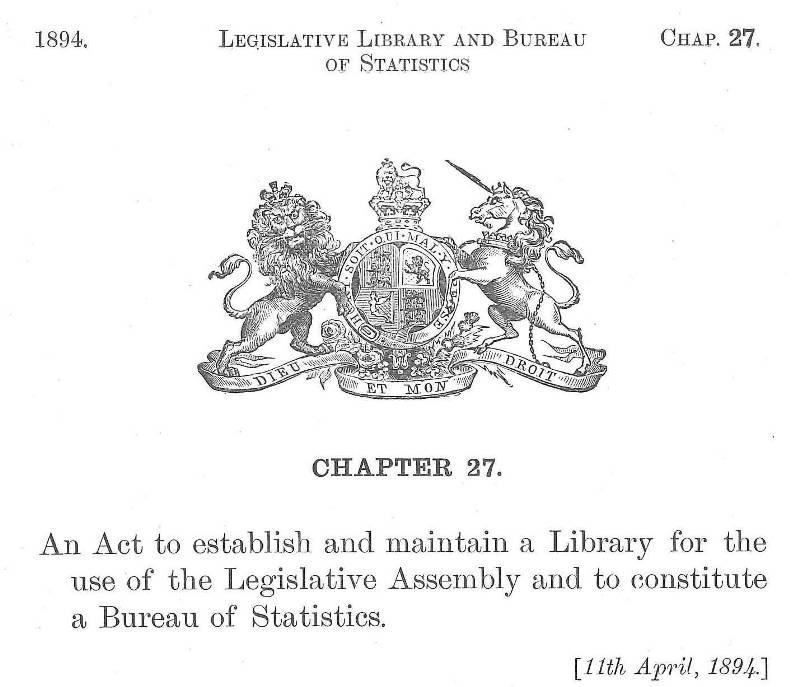
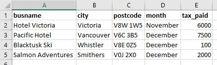
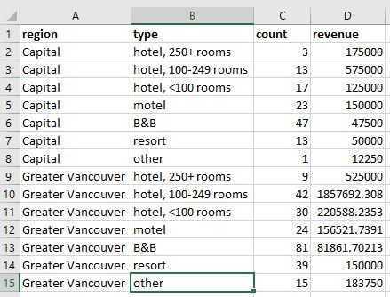
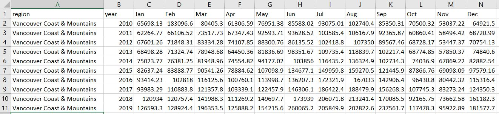
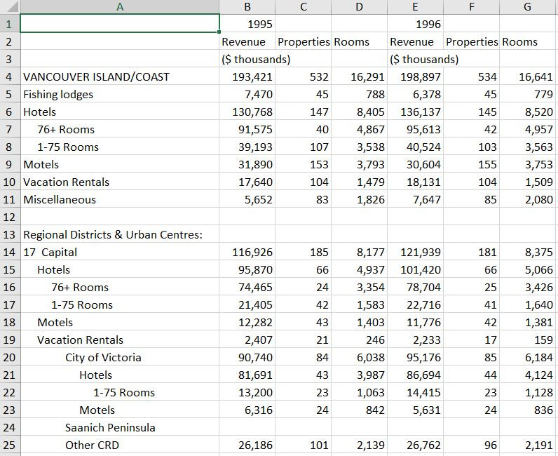
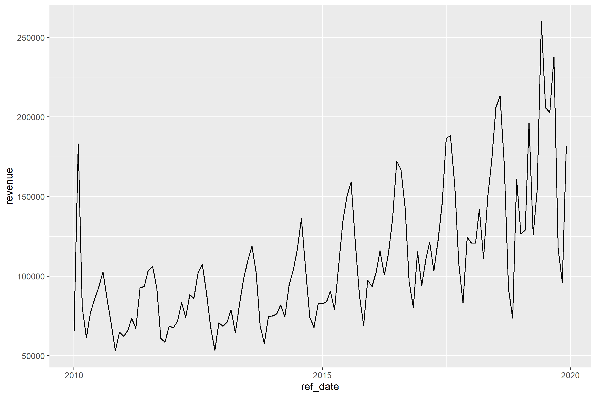
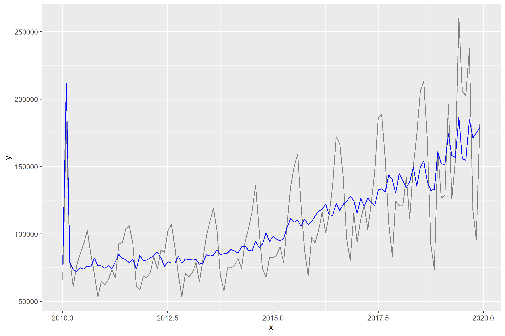

<!--
Copyright 2021 Martin Monkman

This work is licensed under the Creative Commons Attribution 4.0 International License.
To view a copy of this license, visit http://creativecommons.org/licenses/by/4.0/.
-->

date of most recent revision: 2021-02-01

**Data Mishaps, online 2021-02-05**

***

>_ This blog post is a long-form version of the talk I gave as part of the Data Mishaps virtual event on 2021-02-05.
> _Thanks to the event organizers Caitlin Hudon and Laura Ellis for bringing together a variety of people to share their stories._

{width=40%}

***

## A bit of context

I have spent the largest proportion of my career as a public servant at BC Stats, the provincial statistics agency in British Columbia, Canada. I now have the title of "Provincial Statistician & Director", which is (at least in part) the cause of imposter syndrome. In the context of this story, I hope telling you my job title demonstrates that it's possible have a not-insignificant data mishap early in your career, learn from it, and live to tell the tale. 

When I first arrived at BC Stats in the early 1990s, I was filling in for someone who had taken a leave of absence. A big part of the job was estimating the impact of tourism on the provincial economy. Tourism isn't an industry defined in the North American Industry Classification System (NAICS)^[[North American Industry Classification System](https://en.wikipedia.org/wiki/North_American_Industry_Classification_System){target="blank"} at Wikipedia]; tourists purchase souvenirs from the retail industry, and buy services from food & beverage establishments, transportation companies, and accommodation providers.

My colleagues at BC Stats, prior to my arrival, had recognized the opportunity to calculate hotel and motel revenue (what we called "tourism room revenue") by using the records of the amount of tax paid to the Province by each business.^[At the time, British Columbia had a separate Hotel Tax which was levied on all short-term accommodation in properties with four or more rooms. The Hotel Tax has now been repealed, and the general Provincial Sales Tax is now charged on accommodation.] Because we had access to confidential records of each individual business, we were able to calculate detailed revenue estimates by region and accommodation type, by dividing the tax paid by the tax rate.

The workflow looked like this:

1. The data came to us once a month, a single file of roughly 150 megabytes, copied onto two [10 1/2-inch (270 mm) data tapes](https://en.wikipedia.org/wiki/9_track_tape){target="blank"} from the B.C. Government's mainframe computer, delivered by courier in a big pizza box.

_](images/Largetape.jpg){width=40%}

2. We then [copied the data file from the tape using our "compact" tape drive](https://www.youtube.com/watch?v=YqIrMXxPGUA&ab_channel=CuriousMarc){target="blank"} and onto our one-and-only network drive. 

* The raw data looked something like this:

3. Our database specialist had written some code, using [dbase IV](https://en.wikipedia.org/wiki/DBase){target="blank"}, that aggregated the revenue data and created detailed summary tables. The relational database had the raw tax data, and tables that provided details on each property, assigning the property to a category (e.g. hotel or B&B) and using the postal code to identify the city and region. Part of this step was transforming the tax collected into the revenue amount.

* Based on the variable names in the table above, a more precise description of the data manipulation would be:

  - `busname` : join to business listing table to assign property type, count of rooms
  
  - `postcode` : geocode to city and region (Census Division)
  
  - `tax_paid` : divide by the tax rate (7%) to derive a precise revenue amount

* When I first started, the database processing had been taking roughly 12 hours, but when our DBA got a new computer with the first Pentium chip and 40 MB (yes, megabyte) harddrive, it dropped to six hours and we knew we were living in the future. 

* The individual records were aggregated (think `group_by`) region and property type into a single summary table, which was exported as a .db file. The monthly output file looked something like this:

4. I then opened the .db file in Excel, and based on the workflow that my predecessor left me, undertook a number of manual point-and-click steps to restructure the data. This included transposing the direction of the monthly data so that each month was a row instead of a column, and appending that data to existing tables with all of the previous data series. These new tables looked like this: 

5. The final step was to create a report with summary tables, charts, and some analysis text. Here's an example of one of those summary tables:

[British Columbia Room Revenues and Property Counts, Annual 1995 to 1999](https://www2.gov.bc.ca/assets/gov/data/statistics/business-industry-trade/trade/tourism/tourism_room_revenue_data_1995_1999.csv)

(And yes, I now know that it's not in [a tidy format!](https://vita.had.co.nz/papers/tidy-data.pdf)...but that's not the data mishap of this story.^[["The History Of Those Darn Banana Peels"](https://silentology.wordpress.com/2015/04/01/the-history-of-those-darn-banana-peels/)])

After a few months, I discovered that I could apply my rudimentary programming knowledge in support of my statistical analysis, and automate many of the steps using VBA for Excel. 

_And thus, I accidentally became a data scientist—before there was a term for such a thing._

With the addition of automation, the monthly reports were getting done as efficiently as I could manage. This freed up some time, and I set about addressing the extreme seasonality in tourism activity in British Columbia.

As the chart shows, tourism revenue in B.C. has a significant peak in the months of July and August, with intermediate peaks in December and January, and again in March and April. (There was the peak in February 2010 when Vancouver hosted the Winter Olympics, too.)

Working with one of the Economists at BC Stats, I learned about the [X-11-ARIMA software](https://en.wikipedia.org/wiki/X-12-ARIMA){target="blank"}, used by Statistics Canada and the U.S. Bureau of Labor Statistics.

In order to run the seasonal adjustment modeling, we needed more data...so we went back to the folks running the mainframe, and got the tax records going back a few years.

_](images/NDOC_magnetic_tape_library.jpg){width=40%}

After some more data restructuring, I had run the seasonal adjustment, and could produce a chart with a trend line.

The data tables were published, and I turned my attention back to the regular monthly reporting and developing other statistical measures of tourism's economic impact in British Columbia.

## So what was the mishap?

The mishap lay hidden for a few months, until I attended a tourism industry conference in the autumn of 1996. While there I spoke to a few people about the tourism room revenue report, and other initiatives we were involved with to measure the size of the sector. What became quickly apparent was that there were a number of conflicting stories about when the Hotel Tax collection started—some people pointed to 1986, when Vancouver hosted [Expo 86 ](https://en.wikipedia.org/wiki/Expo_86); others pointed further back, to the late 1970s.

Being a bit of a "what are the true facts" sort of nerd, I decided to research the history of the tax, and write a short feature article about it.^["The Hotel Room Tax Act—A Brief History", _B.C. Tourism Room Revenue Report_, BC Stats, September 1996 (PDF)](https://martinmonkman.com/data/penguins_fwf.txt){target="blank"}.] 

What I discovered was that prior to April 1993, the tax rate had been 8%—not the 7% that we had been using as a universal estimate of revenue. This meant that while the revenue tables from April 1993 to (what was then) the present were correct, all of the calculated revenue figures prior to that were too high ($1 of tax at 7% means revenue of $14.29; the same amount of tax at an 8% rate is $12.50.)

From an analysis point of view, this meant that there was the appearance that the industry had stagnated for a year, when in fact it had grown.

### The Response

Re-process the tabulations

Publish the correct tables

Add a revision note to the publication

Engage in a blameless post-mortem

***

## Lesson learned

The big lesson is to understand what's being measured. Something that looks on the surface as the same metric can be influenced by elements that are not directly part of the measure. 

More specifically, we need to know the specifics about how the data are collected—what exactly is being quantified? In my case, the tax being reported was precise: it was exactly the amount paid to the Province of British Columbia, and there was a team of auditors checking to make sure that was the case. But the tax rate had changed, so my revenue calculations were inaccurate. Ok, they were _wrong_.

A similar example exists in the analysis of sports. There can be significant year-over-year changes in rules, or differences in rules between leagues, that can have an impact on what are superficially the same data variables. One example is what is now known as [the "foul-strike" rule](https://www.baseball-reference.com/bullpen/Foul_strike_rule) in baseball: it was adopted in the National League in 1901, but not until 1903 in the American League. An analyst comparing strike-out and walk rates in these two seasons will have to be aware of this rule difference.

Another example from baseball is the fact that every baseball park has different outfield dimensions, was well as different "in play" foul territory. Furthermore, these can change from one year to the next—between the 2012 and 2013 seasons, [the outfield fence of (what was then) Safeco Field in Seattle were moved in between 4 and 17 feet (1.2 to 5.2 meters)](https://www.mlb.com/mariners/news/new-dimensions-make-safeco-more-hitter-friendly-c39364000), with the goal of making it easier for batters to hit home runs.

In other disciplines, a variety of issues can have an impact on the data. A recent report from Reuters on air quality measurement stated "Nearly half of the country’s monitors meant to capture fine particulate matter did not meet federal accuracy standards."^[["U.S. air monitors routinely miss pollution - even refinery explosions"](https://www.reuters.com/article/usa-pollution-airmonitors-specialreport/u-s-air-monitors-routinely-miss-pollution-even-refinery-explosions-idUSKBN28B4RT){target="blank"}]

Stories like this are more common than we might like. But sharing them will help others learn from your mishaps, and (fingers crossed) avoid making them too.

