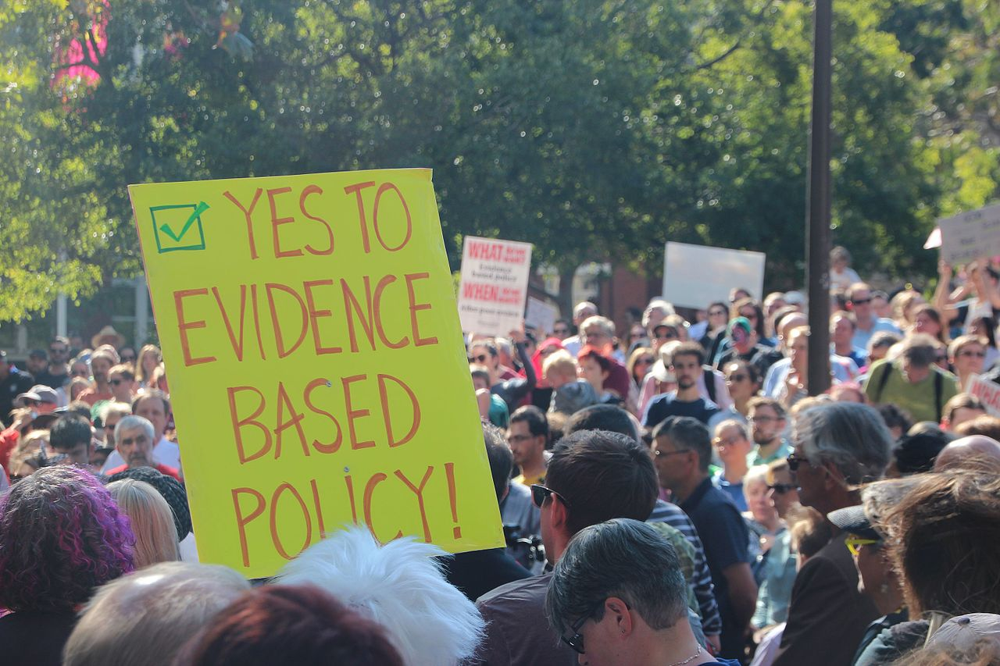
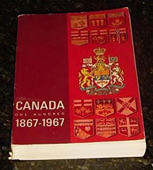
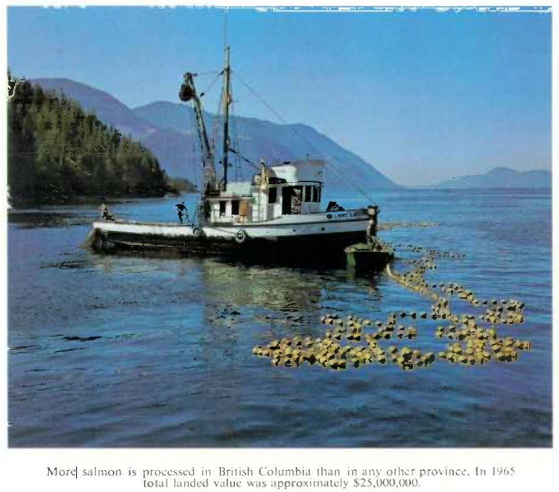
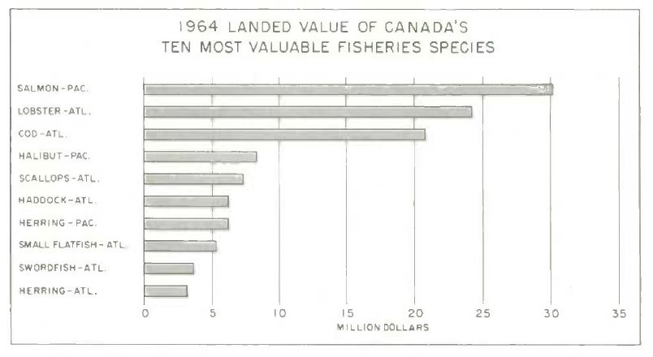
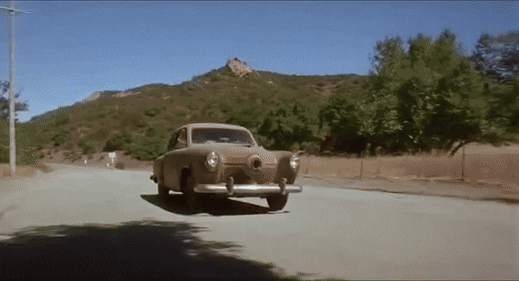
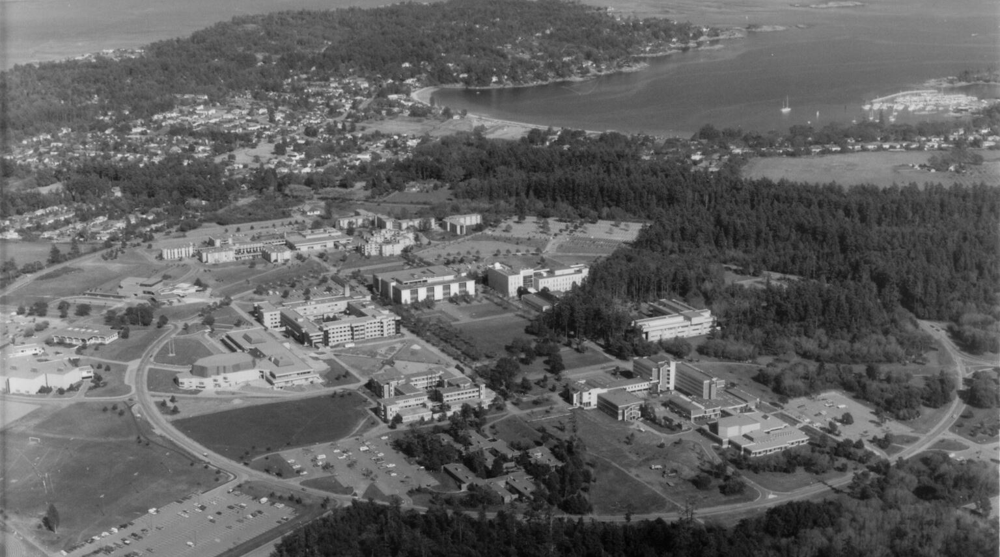

<!--
Copyright 2021 Martin Monkman

This work is licensed under the Creative Commons Attribution 4.0 International License.
To view a copy of this license, visit http://creativecommons.org/licenses/by/4.0/.
-->

>_This blog post is a long-form version of the talk I gave to the Geography 500A class at the University of Victoria on 2021-11-08.
Thanks to Dr. Eduardo Loos for the invitation, and the students in the class for being such an engaged audience._

***

Jean-Paul Sartre wrote "The more sand that has escaped from the hourglass of our life, the clearer we should see through it." I'm not sure that my view through the hourglass of life is all that clear, but a talk like this gives me the opportunity to take the time to think about the key events that led me to where I am.

## It's not as glamorous as it sounds

{width=40%}

I have spent the largest proportion of my career as a public servant at BC Stats, the provincial statistics agency in British Columbia, Canada. I now have the title of "Provincial Statistician & Director", which, by the way, is not as glamorous as it sounds. But I don't have a degree in Statistics...my academic background is Geography. How did I get here? 

The first thing you need to know is what it is that BC Stats does. The organization is part of the British Columbia government, and part of the national statistical system.

> The objective of national statistical systems is to provide relevant, comprehensive, accurate and objective (politically untainted) statistical information. - Ivan Fellegi, Chief Statistician of Canada from 1985-2008 ^[Ivan Fellegi, “Characteristics of an Effective Statistical System”
International Statistical Review / Revue Internationale de Statistique
Vol. 64, No. 2 (Aug., 1996), pp. 165-187
Published by: International Statistical Institute (ISI)
DOI: 10.2307/1403738
https://www.jstor.org/stable/1403738
]

In practice, this means that we provide information to government and other public sector organizations, so that they can make evidence-based policy decisions.

{width=75%}

## My career path

Where does a career path start? And what are the key things that happen that determine the direction of that path?

### An early sign

In 1968 my parents decided to immigrate to Canada. One thing they received as part of their "Welcome to Canada!" package was the 1967 version of the Canada Year Book ^[[Canada one hundred, 1867-1967](https://publications.gc.ca/site/eng/9.845996/publication.html); note that this page contains a link to a scanned version.], published by the Dominion Bureau of Statistics (now known as Statistics Canada). 

This book had some nice pictures of our future home:

As well as an assortment of charts and data tables:

I spent a lot of time with this book over the next few years, absorbed in the details of the geography, demography, and economy of Canada.

If I had been paying attention, I would have said "I love this book so much, I should get a job at the organization that created it." But I wasn't paying attention (probably because I was young), so my path was not a straight line.

### A fork in the road

{width=50%}

Sartre also wrote "We are our choices."

As I was finishing high school in a small town in northern Alberta, many of my choosing to go to the University of Alberta, down south in Edmonton. But I had been to the west coast a few times, and the idea of attending university in the milder climate of coastal British Columbia had a lot of appeal. And as I learned about the universities, I made the choice to attend the University of Victoria. One of the attractions was the newly-established co-op program in the Geography department. Getting discpline-related work experience as part of your degree program was a novelty at the time. (UVic was only the second university in Canada to introduce co-op after Waterloo, and Geography was only the fourth programme at UVic, after Physics, Chemistry, and Computer Science.)

### First jobs after graduation

Physical geography and resource management

Parks

economy

Transportation

### Another fork in the road

Cove

Promo packs

### Grad school

Master’s topic: tourism, with a strong quantitative element

### Personal matters matter

Family

### Good fortune

Landed a co-op job working for the research branch of Tourism BC ...

... who had begun a relationship with BC Stats to measure the economic impact of tourism in B.C. ...

... where a short-term vacancy was about to arise. 

I had the right combination of subject matter knowledge and technical skills to fill the position.

### Tech skills

Punch card 

Drew Conway

Strange Planet

## Observations

1. Nobody ever got rich being a geographer

* Corollary: If you’re in it for the money, you’re studying the wrong thing

1. There is no single correct or ideal route

1. It is never too late to change

1. Technical skills matter

* Corollary: The skills you are learning are transferable

* Corollary: You need to keep learning

### Skills

1. Communication

* Learn to be succinct

1. Project scoping, planning, and management

1. Data collection and analysis

1. Coding

* Reproducible research

1. Geography-specific

* Understanding of regional differences

* Spatial information (projections, typologies)

* GIS

Q: What course would be ideal for graduate students, but isn’t offered? (paraphrase)

### Final observation

* Don’t force yourself to be something you are not

* Focus on your strengths (don't paper over your weaknesses)

* Be authentically who you really are

“We are our choices.”
― Jean-Paul Sartre

-30-
