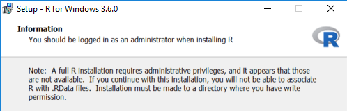

### Data Analytics Coding Fundamentals

In the summer of 2019, I received an offer from the University of Victoria to teach a new course in the Continuing Studies department, ["Data Analytics Coding Fundamentals"](https://continuingstudies.uvic.ca/business-technology-and-public-relations/courses/data-analytics-coding-fundamentals). The course ran for six consecutive Saturdays, starting on November 2, 2019. The course was repeated in the spring of 2020, starting on February 29 (auspiciously, the 20th anniversary of the release of R 1.0!)

The course content—using software to automate data analytics tasks—covers a substantial chunk of what I've learned as part of my day job for, truth be told, three decades. Over the years I have used a variety of different tools in that role, from SPSS and SAS for statistical analysis to VisiCalc and Lotus 1-2-3 spreadsheets. In the past few years I've learned and incorporated R into that work, and seen substantial improvements in my workflow. I was understandably enthusiastic to be given the opportunity to introduce others to the marvel of using R when tackling data analysis problems.

### The path to RStudio Cloud

I had, over the previous three years, participated in a [Software Carpentry lesson](https://software-carpentry.org/lessons/), as well as serving as a tutor in two different day-and-a-half classes taught by [Dr. Charlotte Wickham](https://www.cwick.co.nz/), introducing the tidyverse to people new to R. Not only did I get better at using R as a consequence of these classes, but I also saw some of the challenges that the participants (including myself) faced.

In the courses I'd participated in earlier, where everyone brought their own computers, there was always precious time at the beginning of the first day, spent making sure that we all had the same versions of R and RStudio software installed, and all of the same versions of packages.

This can be doubly challenging for people using the devices provided by their employer, which often have restrictions on what can be installed and where on the machine. "I don't have admin priviledge" is not the sort of thing you want to hear when helping a room full of people  install software.

The participants also had to download the course material files, whether hands-on exercises (as .R or .Rmd) or data (including .csv, .rds, and Excel). 

This setup friction is more than a little frustrating for people new to the software—right out of the gate, they encounter fiddly challenges.

The challenges of both installing software and downloading data can be compounded by the fact that participants might not have connection to wifi, something that sometimes happens when the course is off-site and amplified when the venue (read: academic institution) does not provide a generic public wifi but requires each individual to have a personal user account. Invariably, this requires advance lead time to submit an application and then for the account to be created. Imagine the mayhem if someone was on the waitlist for the class and gets the opportunity to attend because of a last minute cancellation...

Within a week of one of Charlotte Wickham's courses and seeing some of these setup challenges first hand, I attended the Joint Statistical Meeting in Vancouver (the summer of 2018—back in The Before Times) and heard a presentation by Garrett Grolemund of RStudio, ["Streamline Your Class with RStudio"](https://ww2.amstat.org/meetings/jsm/2018/onlineprogram/AbstractDetails.cfm?abstractid=326962). His presentation included launching the alpha version of RStudio Cloud. Charlotte was in the audience, and afterwards we chatted, noting that using RStudio Cloud would have avoided a lot of the friction we encountered just a few days before. After that presentation, I had explored RStudio Cloud a little, and was been impressed by some of the features it provides.

So when the time came a year later for me to lead my own class, RStudio Cloud was immediately something that I considered, and ultimately adopted.

### The Pros of RStudio Cloud

#### 1. The participants in the class start coding almost immediately

The participants start coding on the morning of the first day. There is no need to spend time dealing with the permutations of installs on different operating systems, setting up package libraries, etc. on the first day—that can wait until later in the course.

Instead, we do a bit of an ice breaker, where I introduce myself, talk about data analysis generally and why we want to use a coding environment (some of the participants come with years of Excel experience), and why R specifically. By mid-morning, they are writing code to generate simple charts...whereas in the pre-RStudio Cloud world, this is the point by which we hope that everyone has the software installed.

#### 2. No need to interface with the department's IT support

Normally in a lab situation, the IT department is responsible for ensuring that 25 identical instances of R and packages are installed on the computers in the lab. And woe betide the instructor who shows up on the day before a class with a request to update a package, or install an additional one. 

#### 3. Everyone in the class had the same versions of everything

Everyone has access to identical versions of R and the related packages. In addition, everyone had easy access to the same hands-on exercises and homework assignments, including the data files. No more messy "download this file, unzip into a folder named exactly this, etc". 

This is true both while in the lab _and_ when they are working on assignments at home. 

Futhermore, any work saved in the lab can be picked up and worked on at home, or the library, or the computer at the office.

#### 4. Teaching Python

Adding a module of "data science with Python" was not an issue at all—I simply installed the {reticulate} package in an rstudio.cloud project, and we were on our way. Given that installation of python has a well-earned reputation as being a challenge, being able to use the rstudio.cloud platform eliminated all of that for both the participants and me.

For this module, we recreated an analysis that had been done earlier in the course using R—this gave first-hand exposure to the fact that one can solve data analysis problems using either language.

#### 5. R Projects

I don't have anything beyond an inkling, but I now have the untested hypothesis that using RStudio Cloud begins to inculcate the practice of using self-contained R projects, and adopting [project-oriented workflow](https://rstats.wtf/project-oriented-workflow.html).

### The Cons of RStudio Cloud

#### 1. The participants can avoid learning how to install R themselves

Yes, it's entirely possible that a student can avoid the fun! of installing R on their own computer, and becoming somewhat self-reliant in that regard. But in my experience, having a short module at the end of one of the classes after a week or two sets people up for success. By this time, they are enthusiastic R users, and can see the applications beyond the last day of class. 

#### 2. Set up and class planning requires effort and forethought

Oh wait, that's a "pro". The creator of the class has to make a separate project for each lab and homework assignment inside the course space, _before_ the class starts. This project needs to have the required packages installed, as well as R script files (or R Markdown files) and data files.

I found that this helps me to clarify what I am going to teach—there is no downside to this step.

#### 3. Submitting homework happens outside RStudio Cloud

My solution to this was to have the students submit their code. In the instances where they were working with an R Markdown file, they would submit a knitted HTML file with both the code and the output.

### The sudden transition to online

Another significant advantage to using RStudio Cloud presented itself mid-way through the six week course this spring. On the Friday evening before the third class, the University of Victoria announced that the campus was closing effective Monday due to the COVID-19 pandemic. 

### References and other resources

[RStudio Cloud](https://rstudio.cloud/)

Mine Çetinkaya-Rundel, 2020-03-31, [Teaching R online with RStudio Cloud](https://rstudio.com/resources/webinars/teaching-r-online-with-rstudio-cloud/)—webinar

Mine Çetinkaya-Rundel, 2019-06-12, [RStudio Cloud in the Classroom](https://rstudio.com/resources/webinars/rstudio-cloud-in-the-classroom/)—webinar

Mel Gregory, 2019-08-30, [RStudio Cloud for Education](https://www.youtube.com/watch?v=PviVimazpz8)—presentation (video) 

Samuel Stiyer, 2019-12-31, [RStudio Cloud – The perfect environment to teach R for Data Science](https://softcrylic.com/blogs/rstudio-cloud-the-perfect-environment-to-teach-r-for-data-science/)—blog post 

#### Other resources

Jennifer Bryan and Jim Hester, [What They Forgot to Teach You About R](https://rstats.wtf/index.html)

-30-