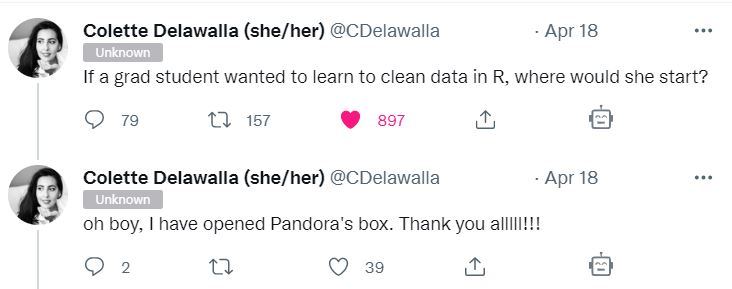
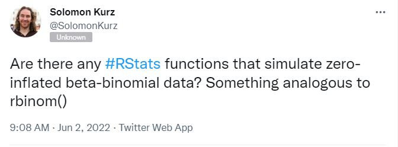
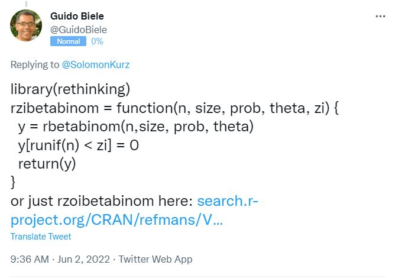
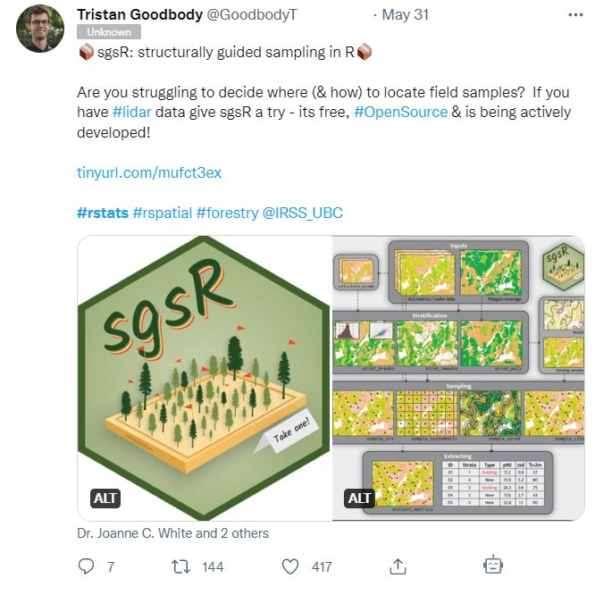
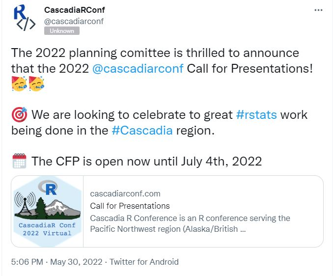
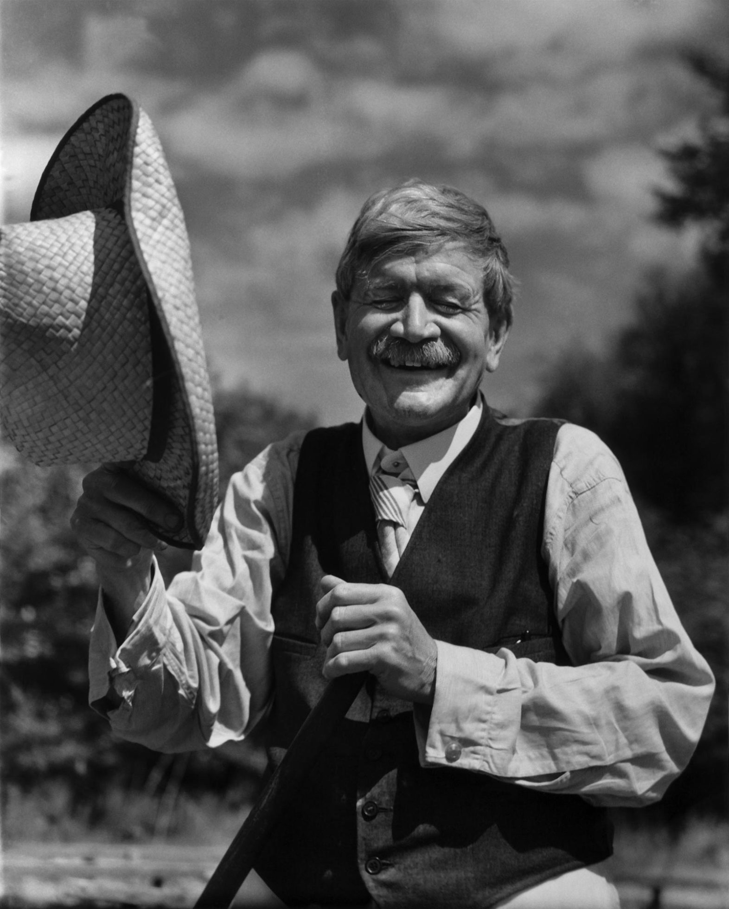

<!--
Copyright 2022 Martin Monkman

This work is licensed under the Creative Commons Attribution 4.0 International License.
To view a copy of this license, visit http://creativecommons.org/licenses/by/4.0/.
-->

>_This blog post is a long-form version of the talk I gave at the Statistical Society of Canada conference on 2022-06-03, one of the invited panelists on "Maintaining Relevancy Through New Tools, Data Science and Data Visualizations"._

***

## Abstract

**Continuous Learning in Times of Continuous Change**

It’s a universally accepted truism that we live in a time of unprecedented change, both in terms of the magnitude and the pace of those changes. In the world of statistics, there have been enormous changes at the intersection of tools, methodologies and techniques, and transparency. New software packages, new ways to analyze data, and new open data arrive every day, each of which have implications for how we approach our professional development. In this talk, I will present observations drawn from applied statistical practice and teaching mid-career professionals that suggest possible responses that will allow us to keep pace with a perpetually shifting ecosystem.

**L'apprentissage continu en période de changement permanent**

C'est un truisme universellement accepté que de dire que nous vivons une époque de changements sans précédent, tant en termes d'ampleur que de rythme de ces changements. Dans le monde des statistiques, les outils, les méthodologies, les techniques et la transparence ont connu d'énormes changements. De nouveaux logiciels, de nouvelles méthodes d'analyse des données et de nouvelles données ouvertes arrivent chaque jour, chacun ayant des implications sur la manière dont nous abordons notre développement professionnel. Dans cet exposé, je présenterai des observations tirées de la pratique de la statistique appliquée et de l'enseignement à des professionnels en milieu de carrière qui suggèrent des réponses possibles qui nous permettront de suivre le rythme d'un écosystème en perpétuelle évolution.

Traduit avec www.DeepL.com/Translator (version gratuite)

***

Stephen Leacock, on getting his Doctor of Philosophy:

>The meaning of this degree is that the
recipient of instruction is examined for the last time in his life, and
is pronounced completely full. After this, no new ideas can be imparted
to him. ^[Preface, [_Sunshine Sketches of a Little Town_](https://onlinebooks.library.upenn.edu/webbin/gutbook/lookup?num=3533), 1912] 

## Career

Leacock was, as we shall see later, clearly being ironic, and of the opposite opinion about learning. Are brains are _never_ full, and in our field, we cannot afford for them to be full, whether we have a PhD or (as in my case) not.

I have been doing this thing we call "applied statistics" or "data science" for a few years. In the first computer science classes I took at university, we used to write our programs, and in the first "statistics for geographers" class we also had data encoded on punch cards.

{width=40%}

When I started at BC Stats in 1993, we relied on [10 1/2-inch (270 mm) data tapes](https://en.wikipedia.org/wiki/9_track_tape){target="blank"} to transfer large data files. (When I say "large", I mean roughly 150 megabytes.) Literally big data, before we had a name for such a thing.

_](images/Largetape.jpg){width=25%}

And I remember word processors before WYSIWYG, and spreadsheets before GUI. 

At the same time, our statistical methods were constrained by the limitations of the tools. Markov chain Monte Carlo (MCMC) methods provide a good example. As Christian Robert and George Casella have written, the paradigm shift of MCMC methods trace back to 1953, but it wasn't until 1990 that the theory and the necessary computing power converged^[Christian Robert and George Casella, "A Short History of Markov Chain Monte Carlo: Subjective Recollections from Incomplete Data", _Statistical Science_, 2011, Vol. 26, No. 1, 102-115. [DOI: 10.1214/10-STS351](https://projecteuclid.org/journals/statistical-science/volume-26/issue-1/A-Short-History-of-Markov-Chain-Monte-Carlo--Subjective/10.1214/10-STS351.full)]

> Dear Reader: In 20 or 30 years, _you_ will be the grizzled veteran, telling stories about the technological and methodological limitations of today...

An interconnected change has been the move towards incorporating reproducibility (that is, "the computations can be executed again with identical results."^[Wikipedia, [Reproducibility](https://en.wikipedia.org/wiki/Reproducibility).]) The requirements of reproducible science are such that our workflows have had to change, using tools that give us the ability to create better documentation and version control. 

I present these as examples as what has changed over the span of my career. We have adapted to typing our instructions into script files, downloading data from websites, pointing and clicking our way around our spreadsheets, and happily adding new methods to our approach to statistical analysis and data science.

## A paradigm shift

But there has been—or perhaps, more accurately, we are in the midst of—a paradigm shift. And it's not just the fact that the tools, methods, and workflow have changed, it's that they now _continuously_ change.

Let's think at software, and how commercial products slowly evolved. As one example, when I was in graduate school, we were using SAS version 6, which lasted a dozen years with . SAS 6.01 had been released in July 1986 and it wasn't until October 1998 that version 7 arrived. Under the SAS/STAT label, the version releases are coming on an annual or biennial cycle. The current version of SAS/STAT, 15.2, was released nearly two years after 15.1.

Open source software, by way of contrast, is in a constant state of development. In the R ecosystem, one I am familiar with, the core of R changes slowly. Updates come every six months or so, and the team of developers are mindful of the introduction of breaking changes.

The packages around the core of R are a different story. There are, as of 2022-05-30, 18,600 packages available on CRAN (the Comprehensive R Archive Network). These are packages that have passed rigorous scrutiny, and are maintained to ensure currency. In addition there are many other packages that are available for download from sites such as GitHub.

We can look at the development history of a widely-used data wrangling package, {dplyr}^[Wickham H, François R, Henry L, Müller K (2022). [_dplyr: A Grammar of Data Manipulation_](https://dplyr.tidyverse.org).]. Version 1.0.0 was released on May 29, 2020. In the space of a little over a year (386 days, to be precise) seven updates were released (version 1.0.7 was released on June 19, 2021). 

## Learning the craft

With new software packages, new ways to analyze data, and new open data arriving every day, how do we keep up? I believe we need to adapt our approach to how we learn (and, for many of us, how we teach).

But how can you stay on top of all of the changes? The answer is "you can't", but there are ways to learn about things that will work for you. 

### Old school 

I want to be very clear: classroom learning remains at the core!

As someone who has recruited and hired recent graduates from various university programs, it's been heartening to see how some courses, and occasionally entire programs, have morphed to adopt new tools and techniques. The core outcomes of the courses remain the same, but the approaches have shifted.

For example, more and more programs are teaching open source tools such as R and Python. Introductory courses give students the opportunity to tackle core statistical methods (such as regression) using new tools, and by introducing those new tools early in their programs, the students are well-positioned to learn new methods in their upper-level and graduate courses.

Another important development is the incorporation of what we might call software engineering approaches—such as version control and code testing—into those courses. This is inherent in the recently minted data science graduate degrees, which are often a joint enterprise of the Statistics and Computer Science departments. These programs are often a "whole is greater than the sum of the parts", particularly when they invite students who have undergraduate degrees in other disciplines.

### Back to school 

For mid-career professionals, there's a need to pick up the tools and skills that the recent graduates have learned. Now, more than ever, recent graduates have (justifiably) less patience for old-school approaches. If they have been taught and seen first-hand the benefits of, say, version control, why would they want to accept working in a place where that is not the default?

At the same time, I don't think it's possible for university programs to teach _everything_ that someone is going to need on the job. I firmly believe that applied statistics is best learned as something like an apprenticeship—the problems that organizations are trying to solve require different approaches, and different data, than what we encounter in the classroom. Context matters!

Perhaps I have a bias, but I also believe that courses tailored for mid-career professionals play an important part in staying relevant.

There are a variety of courses now offered, both in person at your local university and through on-line channels such as Coursera.

One thing in common is that these courses recognize that many participants already know statistics and data analysis—they know the steps in going from raw data to a final artifact (whether a journal article or a briefing for the organization's executive):

](/img/data-science-explore.png)

That is to say, they have a pre-existing interest in this process. What they are looking for is a course that teaches tool use. An analogy would be teaching an established carpenter who has been using a hand saw to build a table, but wants to learn how to use an electric table saw. The carpenter knows how the pieces of wood are going to look before and after they get cut—but now they have a tool to make that process of cutting the wood more efficient.

In the courses I have been teaching as part of the University of Victoria Continuing Studies _Business Intelligence and Data Analytics_ series^[Notably ["Data Analytics Coding Fundamentals"](https://bookdown.org/martin_monkman/DataAnalyticsCodingFundamentals/){target="blank"}], we start with some foundational skills but quickly move to applications of those skills. Towards the end of the course, the participants tackle a project where they follow the data science workflow, from raw data to polished reports, including modeling and visualizations. For some participants, they use pre-structured projects I have assembled. But I leave open the option to bring a workflow from their workplace or a project from their other courses—they can apply their newly honed skills to something immediately relevant. 

I have been a participant in similarly structured one- and two-day workshops where I have benefited from this hands-on applied approach. In courses and workshops like this, the skills become much more familiar. We _learn_, rather than being _taught_.

### Staying on top of things

In addition to formal training, there are, I think, three ways that we can approach self-directed learning to keep up-to-date with what's happening in the field. The three are not mutually exclusive: there's a strong argument to be made that they are inextricably intertwined.

#### Open content

Papers in a prestigious peer-reviewed journals has long been a way to stay apprised of the frontiers of knowledge in our chosen discpline. But for many of us, once we leave the academy, these publications are locked behind paywalls.^[One egregious example: F.J. Anscombe's famous 1973 paper "Graphs in Statistical Analysis" (The American Statistician, 27:1, 17-21, DOI: 10.1080/00031305.1973.10478966), all of 5 pages in length, remains behind a \$55 (US\$ ) paywall.]

Fortunately, there are now more open preprints and blog articles from which we can learn. As an example, [R-bloggers](https://www.r-bloggers.com/) is an aggregator of blog articles written about R. 

A collection of peer-reviewed articles that focused on some of the elements of this paradigm shift is [the special issue of The American Statistician on Data Science](https://www.tandfonline.com/toc/utas20/72/1) (Volume 72, Issue 1, 2018). While some of the authors have paid (out of their own pockets) the ransom to release their papers, [preprints of these same papers have been made freely available](https://peerj.com/collections/50-practicaldatascistats). 

There is also a proliferation of text books, many with a subject-matter emphasis, which in addition to being printed on paper, are freely available online.^[A couple of examples would be Malcolm Haddon's [_Using R for Modelling and Quantitative Methods in Fisheries_](https://haddonm.github.io/URMQMF/) and Kyle Walker's [Analyzing US Census Data: Methods, Maps, and Models in R](https://walker-data.com/census-r/).] This shift in copyright has been of immeasurable benefit.

From a learner's perspective, one of the most valuable changes has been that there are more and more course resources being made available. My introduction to this was when I was learning R, and I stumbled across the [STAT545 website](https://stat545.com/). This course is about using R for "everything that comes up during data analysis **except for statistical modelling and inference**." [Emphasis in the original!] I still refer to this site regularly, and since then I have also found a variety of other open education resources that fill niche needs in my own learning. In addition to the lessons and the code, these sites often include the source data files.

And in the spirit of paying it forward, I have made the materials for the course I teach available under an open license. I'm confident it doesn't get the same traffic as STAT545, but it serves as a reference resource for participants in the course—after they have finished the course they can keep abreast of changes, as I modify the content to incorporate the latest changes in the R ecosystem.

#### Conferences

Conferences give us a chance to learn from our peers, who are giving talks on new topics, which are often a precursor to one of those journal articles.

And we have the opportunity to meet people with whom we would not otherwise have come into contact. Because of COVID-19 we have had three years of virtual conferences, but they are not the same as an in-person event. When we get together, we have those opportunities for the hallway conversations, or when we keep bumping into people at the sessions we've chosen and realize that we share common interests.

In addition to panels at discipline-specific conferences like the SSC Annual Meeting, there are conferences dedicated to specific tools (such as [useR!](https://user2022.r-project.org/) and [EARL, short for Enterprise Applications of the R Language](https://info.mango-solutions.com/earl-conference-2022)) and approaches (the American Statistical Association's [Conference on Statistical Practice](https://www.amstat.org/meetings/conference-on-statistical-practice)).

Most conferences have long created a proceedings publication. Now we might also get videos of talks and live streams—in other words, different ways of accessing the information. Some of these will be about new packages and techniques, or novel applications of existing techniques.

There are also less formal events, such as meet-ups. In addition to providing a venue for presentations, these build local community. 

#### Social media

Another effective strategy is to use social media tools become part of online networks. Connecting to the R user community has helped me learn more, and after a few months of lurking, I started to be one of the people contributing.

Twitter has a well-deserved reputation of revealing both the worst and best of humanity. For me, it has proven to be a platform where I can both get informed about the latest papers and research, and connect to people doing similar things.

The twitter hashtag "#rstats" provides a steady stream of questions and answers, links to new packages, and other news. Here are four recent posts that give a flavour of the range of information that's available. 

First, [a request for some help learning how to clean data with R](https://twitter.com/CDelawalla/status/1516026363484033027?s=20&t=PXGxYxxeuVIKi0d_ddj-9w), which generated 79 replies, many with links to resources freely available on the web:

Second, [a request for a statistical function](https://twitter.com/SolomonKurz/status/1532393680211951617)...

...which got a reply in less than half an hour:

Third, [news about an update](https://twitter.com/GoodbodyT/status/1531744976589033472
) to [the {sgsR} package](https://tgoodbody.github.io/sgsR/):

And finally, [all call for presentations to the up-coming CascadiaR conference:](https://twitter.com/cascadiarconf/status/1531426751951163392)

(You can find me on twitter at [@monkmanmh](https://twitter.com/monkmanmh).)

## Are our brains full?

I opened with a quote from Stephen Leacock, suggesting that our brains have a finite capacity, and one that is filled fairly early in life (if we consider that someone might finish their PhD in their late 20s or early 30s). 

But in truth, Leacock held a very different view^[See also [_Leacock on Life_](https://www.jstor.org/stable/10.3138/9781442676619)]:

>what I want to advocate is not to make education shorter, but to make it much longer—indeed to make it last as long as life itself.

>What I find wrong is the stark division now existing between the years of formal education and entry into the work of life. Education has become to a great extent a mere acquirement of a legal qualification to enter a closed profession, in place of being a process undertaken for its own sake. **All that is best in education can only be acquired by spontaneous interest; thus gained it lasts and goes on.**^[Preface, [_Too Much College, or, Education Eating Up Life_](https://gutenberg.ca/ebooks/leacock-toomuchcollege/leacock-toomuchcollege-00-h.html), 1939. Emphasis added.]

-30-
